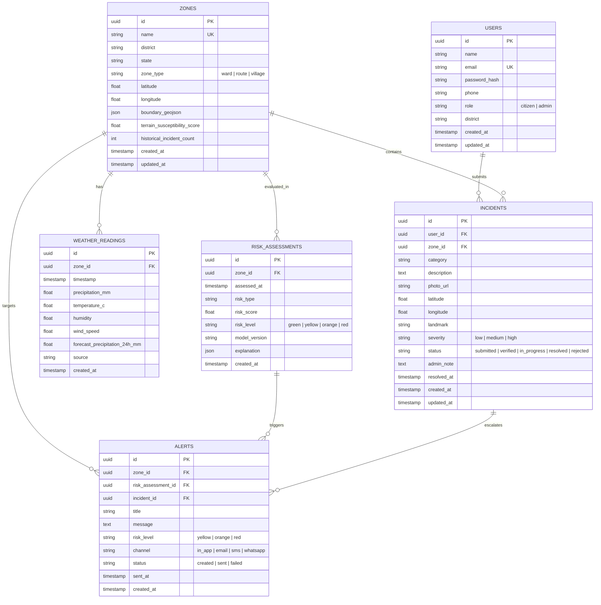

# HimalayaSense Database Schema

The database architecture supports PostgreSQL (Production) and SQLite (Development Fallback) with UUID primary keys and JSON support.

```mermaid
erDiagram
    USERS ||--o{ INCIDENTS : submits
    ZONES ||--o{ INCIDENTS : contains
    ZONES ||--o{ WEATHER_READINGS : has
    ZONES ||--o{ RISK_ASSESSMENTS : evaluated_in
    ZONES ||--o{ ALERTS : targets
    RISK_ASSESSMENTS ||--o{ ALERTS : triggers
    INCIDENTS ||--o{ ALERTS : escalates

    USERS {
        uuid id PK
        string name
        string email UK
        string password_hash
        string phone
        string role "citizen | admin"
        string district
        timestamp created_at
        timestamp updated_at
    }

    ZONES {
        uuid id PK
        string name UK
        string district
        string state
        string zone_type "ward | route | village"
        float latitude
        float longitude
        json boundary_geojson
        float terrain_susceptibility_score
        int historical_incident_count
        timestamp created_at
        timestamp updated_at
    }

    WEATHER_READINGS {
        uuid id PK
        uuid zone_id FK
        timestamp timestamp
        float precipitation_mm
        float temperature_c
        float humidity
        float wind_speed
        float forecast_precipitation_24h_mm
        string source
        timestamp created_at
    }

    RISK_ASSESSMENTS {
        uuid id PK
        uuid zone_id FK
        timestamp assessed_at
        string risk_type
        float risk_score
        string risk_level "green | yellow | orange | red"
        string model_version
        json explanation
        timestamp created_at
    }

    INCIDENTS {
        uuid id PK
        uuid user_id FK
        uuid zone_id FK
        string category
        text description
        string photo_url
        float latitude
        float longitude
        string landmark
        string severity "low | medium | high"
        string status "submitted | verified | in_progress | resolved | rejected"
        text admin_note
        timestamp resolved_at
        timestamp created_at
        timestamp updated_at
    }

    ALERTS {
        uuid id PK
        uuid zone_id FK
        uuid risk_assessment_id FK
        uuid incident_id FK
        string title
        text message
        string risk_level "yellow | orange | red"
        string channel "in_app | email | sms | whatsapp"
        string status "created | sent | failed"
        timestamp sent_at
        timestamp created_at
    }
```
